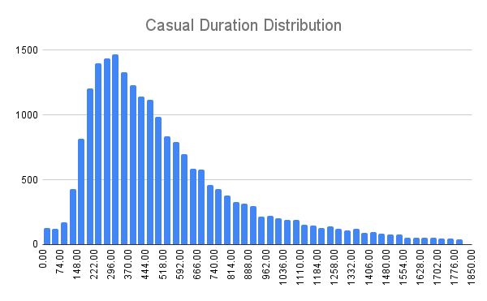
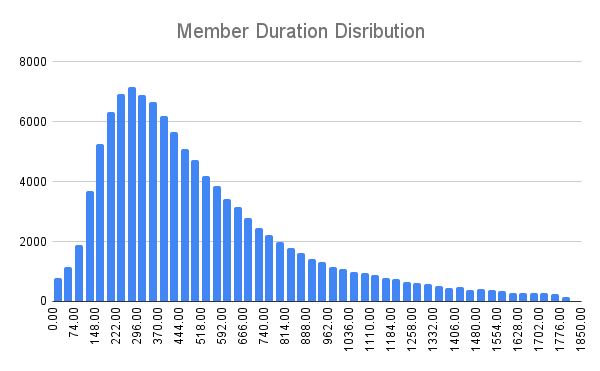

# Cyclist - Google DA Certificate Case Study
## Ask
The question is: How do annual members and casual riders use Cyclistic bikes differently?
## Prepare
The dataset I used due to limitation of memory: 2024-01
## Process
### Step 1:factor exploration
- Rider_id: identical so removed
- ride_type: catogorical data type/ can be used to calculate the percentage of users in each group
- started_at/ended_at:Time frame data type: can be used to calculate the riding duration and day of week, hour of day of riding, after calculating duration, ended_at dimension can be deleted.
- start_station_name/start_station_id/end_station_name/end_station_id: categorial data type/ there are a lot of places to start with and end with. I don't include the demographic analysis in this report so removed the fatcors.
- start_lat/start_lng/end_lat/end_lng:start and end latitude and longitude. Can be used to calcuate the displacement rid using distance formulae. After that, the four dimensions can be removed.
- member_casual: categorical data/only has two catogories: member/casual
### Step 2: remove and create factors
- Rider_id removed
- Duration: ended_at - started_at -> format as seconds
- ended_at removed
- start_station_name	start_station_id	end_station_name	end_station_id removed
- Length = $`\sqrt{(startLat-endLat)^2+(startLng-endLng)^2}*111111`$ ([one degree of movement in longtitude or latitude is equal to 111111 meters](https://gis.stackexchange.com/questions/5821/calculating-latitude-longitude-x-miles-from-point#:~:text=The%20northwards%20displacement%20is%20r,(latitude)%20%2F%20111111%20degrees.))
- start_lat	start_lng	end_lat	end_lng removed
  dayofweek/ hourofday: extract weekday number and hour from start_at to analysis further -> start_at removed.
### Step 3 check if data is complete
- there is no missing value
- data in each column are consistent
### Step 4 check the validity of data
- the member_casual/ride_type are fine
- Duration: there are duration longer than 24 hours, 21 rows, can use formulae to make the duration valid but I will exclude this case since 21/144874 is too little.
- distance: there are zero distance which is meaningless data in this report, so exclude 6236 rows.
- Duration continued: there are zero duration records after removing zero distance records, so remove 18 rows.
- Bicycle speed: classic bicycle maximum speed is normally [8.5 m/s with down a gentle 5% slope](https://road-bike.co.uk/articles/average-speed.php#:~:text=Average%20speed%20-%20indications&text=Beginner%2C%20short%20distance%20(say%2010,)%3A%20average%20around%2016-19) and eletric bicycle maximum speed is normally [12.51m/s](https://www.gazellebikes.com/en-us/how-fast-do-electric-bikes-go#:~:text=Pedal%20assist%20motor&text=Most%20ebikes%20stop%20providing%20electric,into%20the%20current%20classification%20system.) Hence I exclude records exceed the limit in each category. 617 rows excluded.
## Analysis
Discovering each factor's relationship with member_casual:
Total 137985 records, 115346 members, 22638 casuals. This is an imbalance data but we are not predicting anything in this report, so ignore this issue.
### Rider_Type
Type_Distribution(%)  | Electric | Classic
------------- | ------------- | -------------
Casual  | 58.34  |  41.65
Member  | 45  |  55

From the table we can see that casual riders prefer electric bikes whereas member riders like classic bikes more. This could be caused by singe trip fee difference bettween classic and electric.
### Duration Type
Duration Type(%)  | Less than Half Hour | 0.5 - 1 hour | 1 - 2 hours | More than 2 hours
------------- | ------------- | ------------- | ------------- | ------------- 
Casual  | 94.57  |  3.77 | 0.96 | 0.71
Member  | 96.65  |  2.73 | 0.25 | 0.37

From the table we can see both of the majority users are riding less than half hour. Hence let's take a closer look at the half hour distribution:

Casual             |  Member
:-------------------------:|:-------------------------:
  |  

From the chats, we can conclude that they are similai in distribution of duration withitn one hour.

### Distance 
